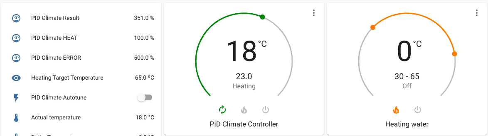
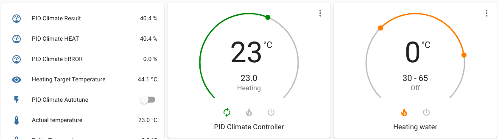
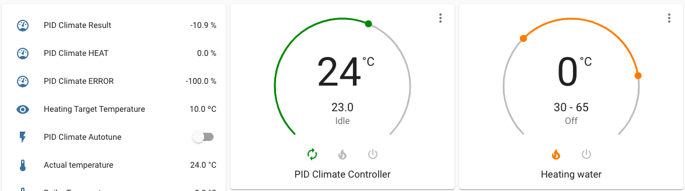

# ESPHome OpenTherm

This is an example of a integration with a OpenTherm boiler using [ESPHome](https://esphome.io/) and the [Ihor Melnyk](http://ihormelnyk.com/opentherm_adapter) or [DIYLESS](https://diyless.com/product/esp8266-thermostat-shield) OpenTherm Adapter 

## Installation
- Copy the content of this repository to your ESPHome folder
- Make sure the pin numbers are right, check the file opentherm_component.h in the esphome-opentherm folder.
- Edit the opentherm.yaml file:
    - Make sure the board and device settings are correct for your device
    - Set the sensor entity_id with the external temperature sensor's name from Home Assistant. (The ESPHome sensor name is temperature_sensor).
- Flash the ESP and configure in Home Assistant. It should be auto-discovered by the ESPHome Integration.

## Controlling the heating temperature with PID climate controller

With the PID controller we can make the temperature of the radiators to be variable within a range.

- When the room is cold, we want the radiators to heat up a lot to reach the desired temperature quickly. 

  

- When the room temperature is close to the desired temperature, we want to lower the temperature of the radiators to maintain it and save energy.

  

- When the room temperature exceeds the desired temperature, we want the radiators to be turned off but still have water circulation.

   

